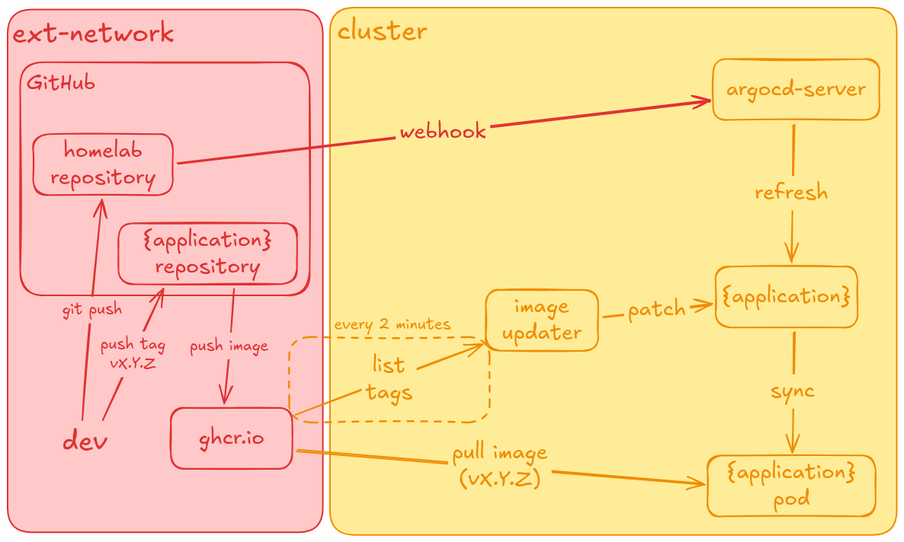
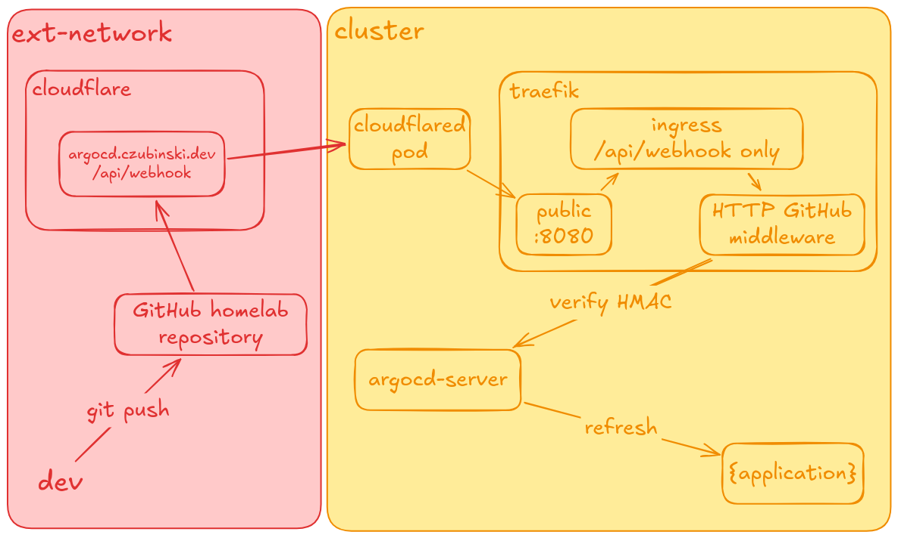
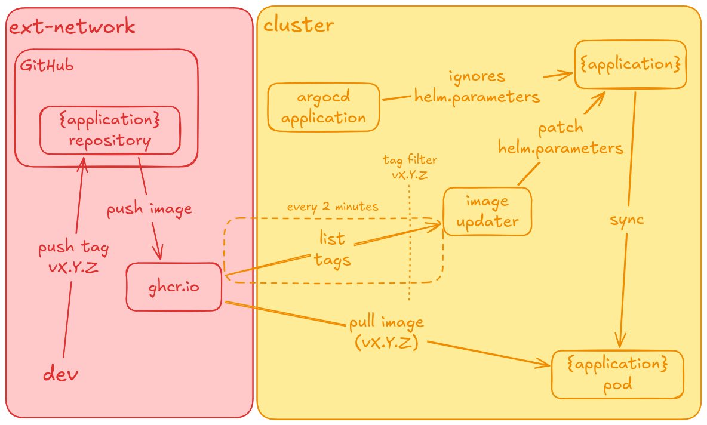

# Argo CD

## Overview

[Argo CD](https://argo-cd.readthedocs.io/) runs in the cluster and keeps it in sync with this repo. Everything under `infra/` and `apps/` is applied by Argo.

- **Source of truth:** `git@github.com:MescoCzubinski/homelab.git`, branch `main`
- **Sync policy:** automated, with `prune` and `selfHeal`, so manual changes in the cluster are reverted
- **Image tags:** the only thing not in git, see [Image Updater](#image-updater)

## App of apps

One parent Application, `argocd`, manages Argo itself and every file in `infra/argocd/applications/`. The parent deploys:

- the Argo CD chart itself
- the GUI ingress from the chart (`server.ingress`), `ingress-gh.yaml` and `sealed-secret.yaml` from `infra/argocd`
- one child Application per file in `applications/`

## Multi-source

Most Applications use three sources, so the chart comes from upstream and the values stay in this repo:

1. upstream Helm chart, values from `$values/...`
2. this repo, only `ref: values`, so `$values` points at it
3. this repo, `path` with extra manifests (ingress, sealed secrets)

Source 3 is optional. It is how plain manifests are deployed together with a chart.

## Webhook

A push to this repo triggers a GitHub webhook to `argocd.czubinski.dev/api/webhook`, so Argo refreshes right away instead of waiting for its ~3 min poll.

- **Ingress:** `ingress-gh.yaml` exposes only `/api/webhook` on the `public` entrypoint
- **Middleware:** `http-gh-only` lets through only GitHub's webhook IP ranges, read from `X-Forwarded-For` because requests arrive through `cloudflared`
- **Signature:** `configs.secret.githubSecret` reads `argocd-webhook:github`, so Argo rejects payloads not signed with that secret

## Image Updater

Argo CD Image Updater watches GHCR and moves each app to the newest semver tag, without a commit to this repo.

- **Config:** one `ImageUpdater` CR per app in `infra/argocd-image-updater/image-updaters.yaml`
- **Tags:** only `vX.Y.Z` is considered (`allowTags`), strategy `semver`
- **Write-back:** `method: argocd`, so the new tag is stored as `helm.parameters` on the Application, not in git
- **Baseline:** `tag: v0.0.1` in each app's `values.yaml` is only the starting point, the live tag is in the cluster
- **Registry:** `ghcr.io`, credentials from `argocd/ghcr-pull`

### Self-heal vs. the updater

The parent app deploys the Applications from git. The updater adds `helm.parameters` that git doesn't have, so `selfHeal` would revert them. The parent app avoids that with:

- `ignoreDifferences` on `.spec.sources[].helm.parameters`, so the updater's change is not drift
- `RespectIgnoreDifferences=true`, so a sync for another reason keeps the parameters instead of overwriting them from git
