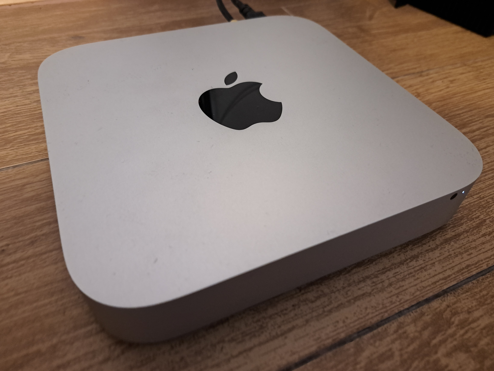

# Mac Mini (2012)

## Processor (CPU)

- **Model:** Intel Core i7-3720QM (Ivy Bridge)
- **Cores/Threads:** 4 Physical / 8 Logical
- **Clock Speed:** 2.60 GHz (Base) / 3.60 GHz (Turbo)
- **L3 Cache:** 6 MB
- **Architecture:** x86_64

## Memory (RAM)

- **Total Capacity:** 16 GB (15 GiB reported by OS)
- **Configuration:** 2x8 GB (Dual Channel confirmed by capacity)

## Storage (Disk)

- **Main Drive:** 250 GB SSD

## Operating System

- **OS:** Fedora Linux 44 (Server Edition)
