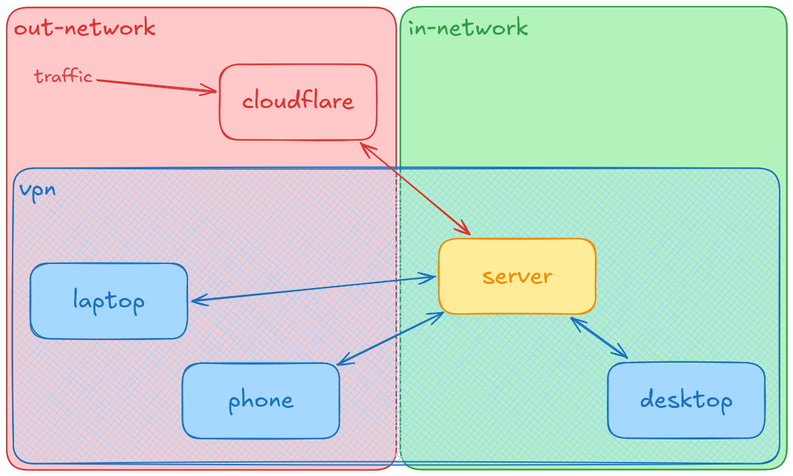
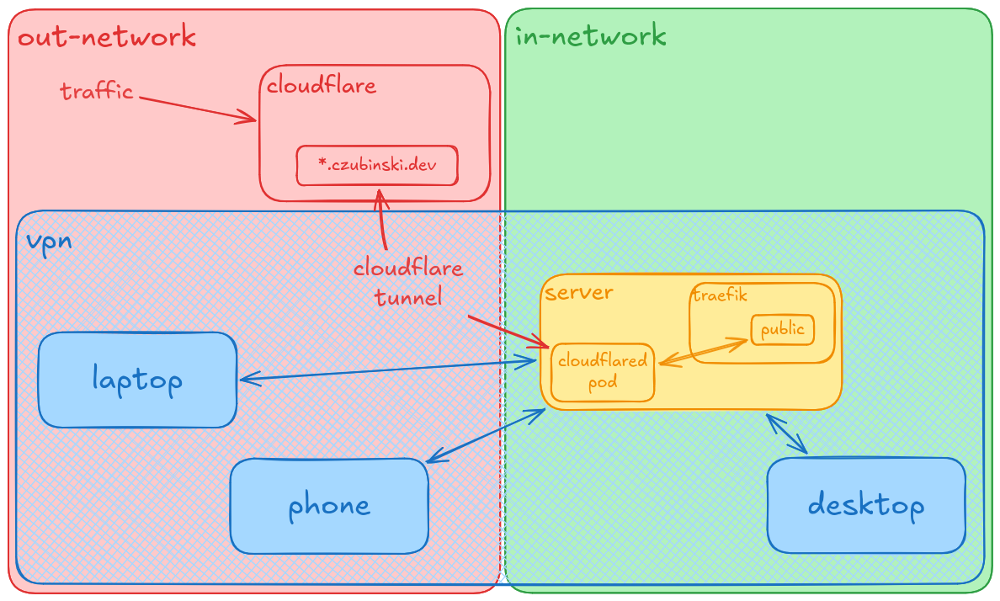
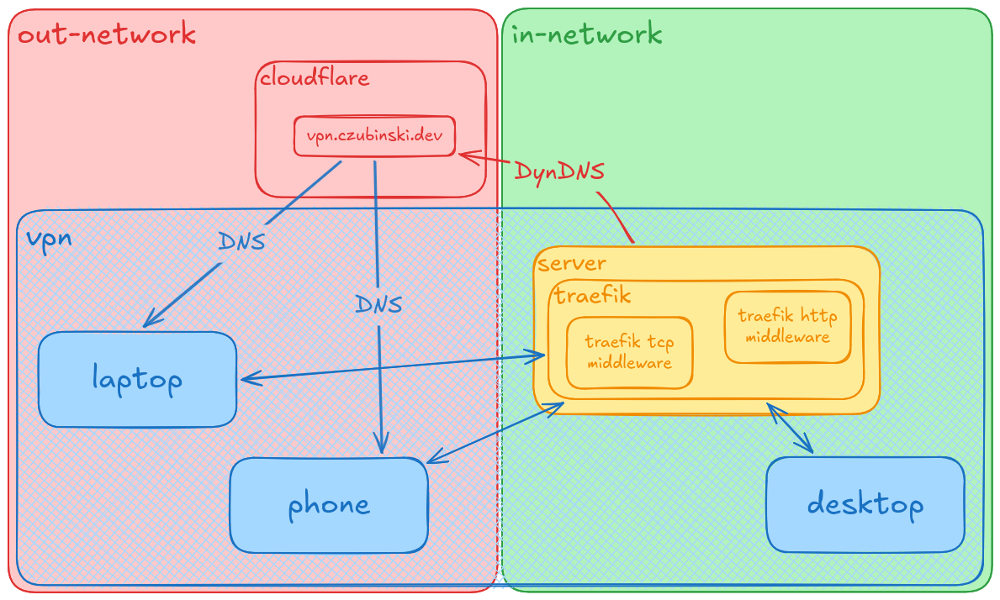
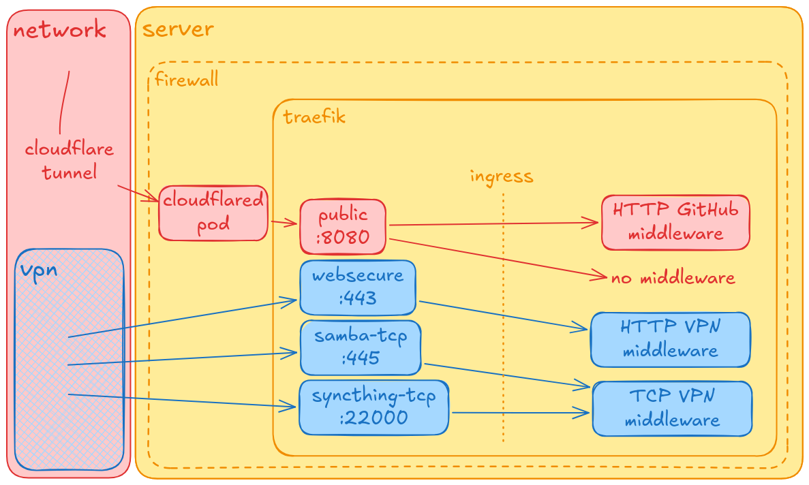

# Network

## Overview

There are two ways to reach the server. Public traffic goes through Cloudflare and a tunnel, so no ports are opened. Private traffic goes through the VPN and can reach everything else.



## DNS

Records in Cloudflare (not in this repo):

| record              | points to          | proxied |
| ------------------- | ------------------ | ------- |
| `czubinski.dev`     | Cloudflare Tunnel  | yes     |
| `*.czubinski.dev`   | Cloudflare Tunnel  | yes     |
| `vpn.czubinski.dev` | home IP, by DynDNS | no      |

## Public traffic

`*.czubinski.dev` is proxied by Cloudflare, which also terminates TLS. The `cloudflared` pod opens an outbound tunnel to Cloudflare, so public requests come back through it into the cluster and reach Traefik's `public` entrypoint. Tunnel routing is configured in the Cloudflare dashboard, not in this repo.



Traefik trusts `X-Forwarded-*` headers from `cloudflared` (`trustedIPs: 10.244.0.0/16`), so apps see the real client IP. The GitHub middleware reads that IP, so it breaks without it.

## VPN

The server updates `vpn.czubinski.dev` with DynDNS. VPN clients resolve this name to find the server, and the record is DNS-only (not proxied). Once connected, devices can reach Traefik's private entrypoints on `192.168.0.1`.



The home network (in-network) is not treated as trusted. Being on the same LAN gives no access, so the desktop connects through the VPN like the laptop and phone. The only exception is SSH (key-only), kept open on the LAN as a fallback when the VPN breaks.

## Firewall

Router: static IP `192.168.1.100` for the server, only WireGuard `51820/udp` forwarded to it.

Server (firewalld):

| zone                     | matches               | open                                     |
| ------------------------ | --------------------- | ---------------------------------------- |
| `FedoraServer` (default) | LAN, `enp1s0f0`       | `51820/udp`, ssh, dhcpv6-client          |
| `vpn`                    | WireGuard, `wg0`      | `443`, `445`, `6443`, `22000` (tcp), ssh |
| `trusted`                | pods, `10.244.0.0/16` | everything                               |

`443`, `445` and `22000` are Traefik entrypoints, `6443` is the Kubernetes API (kubectl over VPN).

## Traefik

Entrypoints decide where traffic comes in. Middlewares decide who is allowed through.



| entrypoint             | reachable from               | middleware               |
| ---------------------- | ---------------------------- | ------------------------ |
| `public :8080`         | `cloudflared` only (cluster) | none, or GitHub IPs only |
| `websecure :443`       | VPN                          | HTTP VPN only            |
| `samba-tcp :445`       | VPN                          | TCP VPN only             |
| `syncthing-tcp :22000` | VPN                          | TCP VPN only             |

Ports in [values.yaml](../infra/traefik/values.yaml): `port` is where Traefik listens in the pod, `exposedPort` is the Service port (used only by `public`), `hostPort` is the port on the VPN IP `192.168.0.1`. `additionalArguments` override entrypoint addresses to `:<port>`, because the chart prefixes them with `hostIP`, which doesn't exist inside the pod.

### Exposing an app

HTTP, pick the annotations:

```yaml
# private (VPN)
traefik.ingress.kubernetes.io/router.entrypoints: websecure
traefik.ingress.kubernetes.io/router.middlewares: default-http-vpn-only@kubernetescrd

# public
traefik.ingress.kubernetes.io/router.entrypoints: public

# public, GitHub only
traefik.ingress.kubernetes.io/router.entrypoints: public
traefik.ingress.kubernetes.io/router.middlewares: default-http-gh-only@kubernetescrd
```

An ingress without the `entrypoints` annotation lands on `websecure` (`asDefault: true`) without any middleware.

TCP needs a new entrypoint in [values.yaml](../infra/traefik/values.yaml) (`ports` with `hostPort` + `hostIP`, and a line in `additionalArguments`) and an `IngressRouteTCP`:

## TLS

- **Public:** Cloudflare terminates TLS, and the tunnel to `cloudflared` is encrypted.
- **VPN:** Traefik serves a Let's Encrypt wildcard cert for `czubinski.dev` and `*.czubinski.dev` on `websecure`. It is issued through the Cloudflare DNS challenge, so no open port is needed, and stored on the `traefik-acme` volume.
