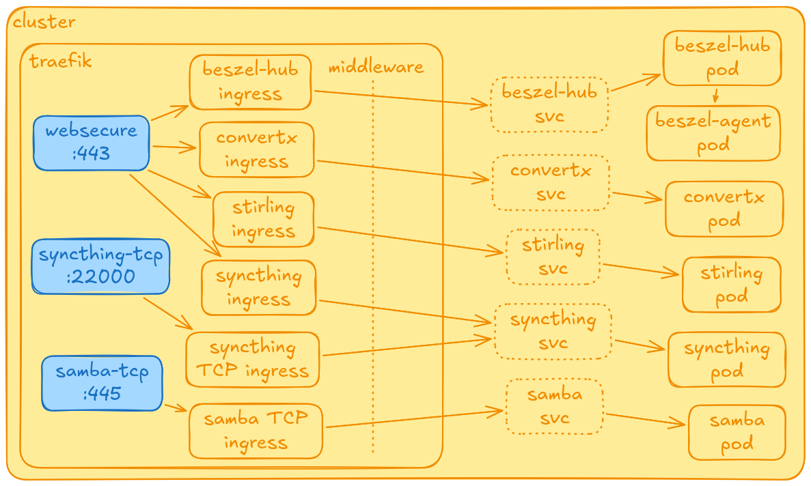

# Tools

Self-hosted tools from [tools/](../tools/), synced together by one [Argo CD](argocd.md) Application. All are VPN-only (see [network.md](network.md)).

Dashed `svc` boxes are config only: Traefik reads pod IPs from them and connects to pods directly.

| tool         | what                          | address                             | data on host                           |
| ------------ | ----------------------------- | ----------------------------------- | -------------------------------------- |
| Beszel       | server monitoring             | `beszel.czubinski.dev`              | `/home/server/beszel/hub-data`         |
| ConvertX     | file conversion               | `convert.czubinski.dev`             | `/home/server/convertx/data`           |
| Stirling PDF | PDF tools                     | `stirling.czubinski.dev`            | `/home/server/stirling/config`         |
| Syncthing    | file sync                     | `syncthing.czubinski.dev`, `:22000` | `/home/server/syncthing/{config,data}` |
| Samba        | network share `Shared`        | `\\192.168.0.1\Shared` (`:445`)     | `/home/server/samba/Shared`            |

- **Beszel:** the agent is a DaemonSet with `hostNetwork` and read-only `/proc` and `/sys`, the hub connects to it on `:45876`.
- **Syncthing:** `config.xml` is copied from a ConfigMap on start.

All data lives in `hostPath` under `/home/server/`, so that directory is what needs a backup. Traefik's certificates are there too (`/home/server/traefik/acme`).
