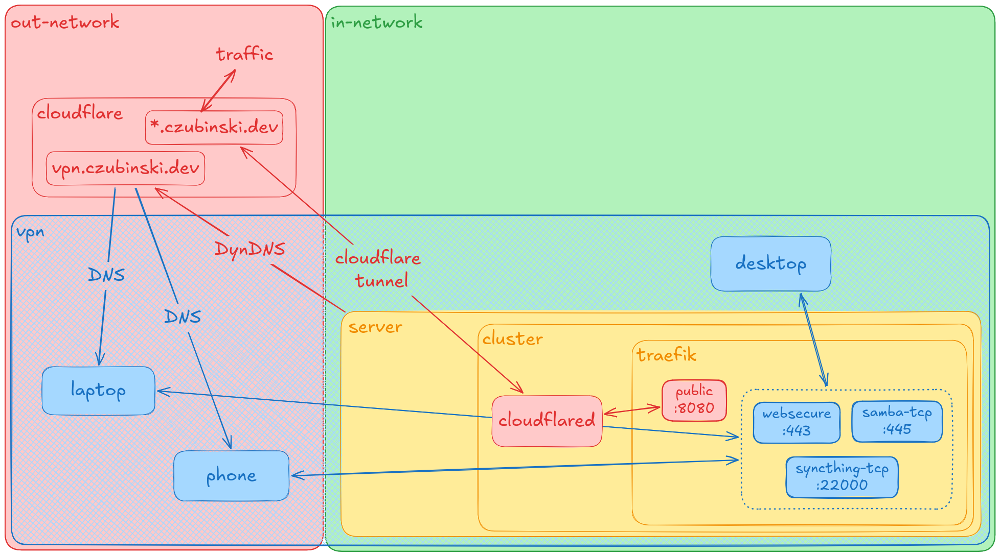

# Homelab

Single-node Kubernetes homelab on a Mac Mini, run with k0s and managed by Argo CD in GitOps style. Public apps are reached through a Cloudflare Tunnel with no open ports, while private tools sit behind a VPN.



## Stack

| Layer         | Tool                                                                                                                |
| ------------- | ------------------------------------------------------------------------------------------------------------------- |
| Hardware      | Mac Mini 2012, i7-3720QM, 16 GB RAM, 250 GB SSD ([hardware.md](.docs/hardware.md))                                  |
| Kubernetes    | [k0s](https://k0sproject.io), config in [cluster/k0s.yaml](cluster/k0s.yaml)                                        |
| GitOps        | [Argo CD](https://argo-cd.readthedocs.io) ([argocd.md](.docs/argocd.md))                                            |
| Ingress       | [Traefik](https://traefik.io), config in [infra/traefik/values.yaml](infra/traefik/values.yaml)                     |
| Public access | [Cloudflare Tunnel](https://developers.cloudflare.com/cloudflare-one/connections/connect-networks/) (`cloudflared`) |
| Secrets       | [Sealed Secrets](https://github.com/bitnami-labs/sealed-secrets)                                                    |

## File structure

```
cluster/          k0s cluster config
charts/
  app/            Helm chart for my own apps
infra/
  argocd/         Argo CD itself + applications/
  cloudflared/    Cloudflare Tunnel
  sealed-secrets/ Sealed Secrets controller
  traefik/        Traefik values, middlewares
apps/             my own apps
  homepage/
  meetly/
tools/            self-hosted tools
  beszel/
  convertx/
  samba/
  stirling/
  syncthing/
.docs/            docs and diagrams
```

Every app in `apps/` is a `values.yaml` for the shared [charts/app](charts/app/) Helm chart (Deployment, Service, Ingress), plus `namespace.yaml` and, if needed, `sealed-secret.yaml`. Every tool in `tools/` is a plain directory of manifests. Argo CD entrypoint is [infra/argocd/applications/](infra/argocd/applications/), details in [.docs/argocd.md](.docs/argocd.md).

## Services

| Service                         | Address                             | Access                          |
| ------------------------------- | ----------------------------------- | ------------------------------- |
| [homepage](apps/homepage/)      | `czubinski.dev`                     | public                          |
| [meetly](apps/meetly/)          | `meetly.czubinski.dev`              | public                          |
| [Argo CD](infra/argocd/)        | `argocd.czubinski.dev`              | VPN, public for GitHub IPs only |
| [Beszel](tools/beszel/)         | `beszel.czubinski.dev`              | VPN                             |
| [ConvertX](tools/convertx/)     | `convert.czubinski.dev`             | VPN                             |
| [Stirling PDF](tools/stirling/) | `stirling.czubinski.dev`            | VPN                             |
| [Syncthing](tools/syncthing/)   | `syncthing.czubinski.dev`, `:22000` | VPN                             |
| [Samba](tools/samba/)           | `:445`                              | VPN                             |

Tool details and where their data lives: [.docs/tools.md](.docs/tools.md).

## Networking

- **Public:** `*.czubinski.dev` is proxied by Cloudflare and reaches the cluster through the `cloudflared` tunnel, landing on Traefik's `public` entrypoint. No ports are opened on the router.
- **VPN:** `vpn.czubinski.dev` is kept up to date with DynDNS. Connected devices reach Traefik's private entrypoints on `192.168.0.1`.
- **Traefik:** entrypoints decide where traffic comes in, middlewares ([infra/traefik/](infra/traefik/)) decide who gets through.

Diagrams per flow and ingress annotation snippets: [.docs/network.md](.docs/network.md).

## Roadmap

See [.docs/TODO.md](.docs/TODO.md).
